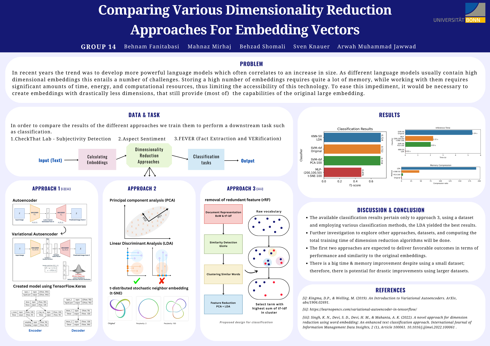
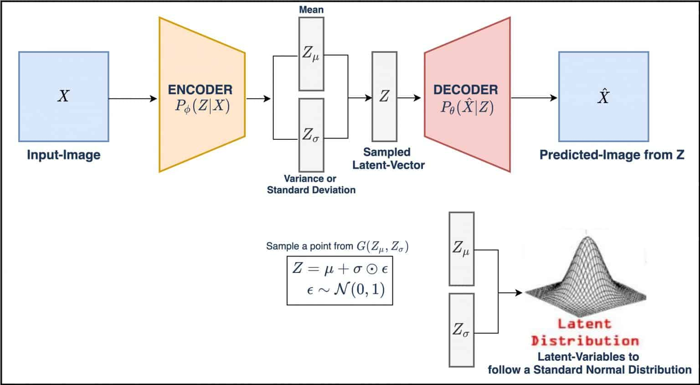
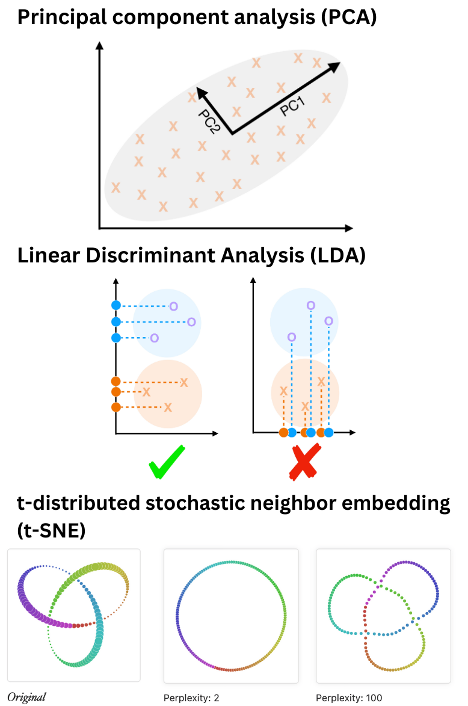
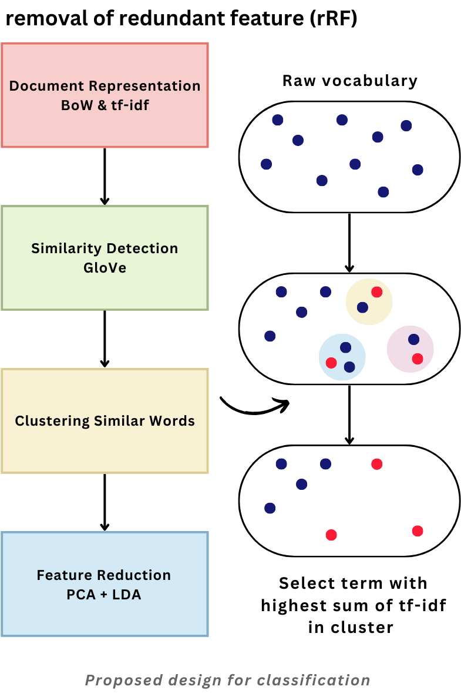
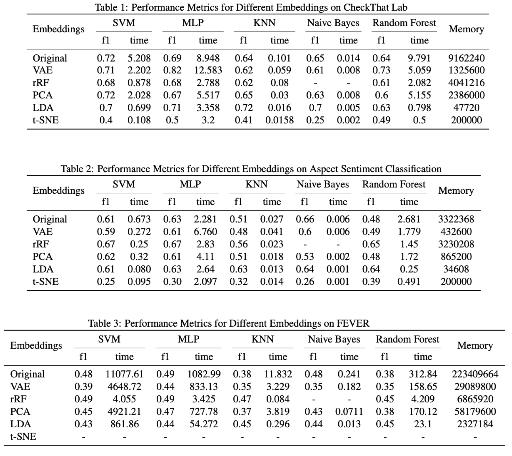

# NLP - Embedding Dimensionality Reduction Approaches

    

## Overview
In recent years, the trend has been to develop more powerful, but larger, language models with high-dimensional embeddings. However, this poses storage and resource challenges, limiting accessibility. To address this, we explored dimensionality reduction techniques for embeddings, including Variational Autoencoder (VAE), traditional methods, and a novel approach combining document and *GloVe* word embeddings. We used these approaches for classification on various datasets, reducing the need for dataset-specific dependencies.

## Goals and Expectations:
* **Semantic Preservation:** We aim to assess compression techniques' ability to maintain the original models' semantic information.

* **Computational Efficiency:** Our primary objective is to identify techniques that not only match the original models' performance but also reduce computational complexity in terms of memory and time.

* **Robustness to Noise:** We expect the compressed models to demonstrate resilience against noisy or perturbed inputs in real-world scenarios.

## Dataset
In order to compare the results of the language models with compressed embeddings we train them to perform a downstream task such as classification on different datasets. For this, we used the following three classification datasets to compare the results ([datasets](https://github.com/s-knauer/nlp-edra/tree/main/datasets)):
- **Dataset: CheckThat Lab - Subjectivity Detection:**
    - The task is to predict whether a given sentence from a news article is subjective or objective.
    - The train/dev/test set contains 830/219/244 sentences
    - The data contains binary labels `SUBJ` or `OBJ`

- **Dataset: Aspect Sentiment Classification Dataset:**
    - The aim is to classify the sentiment toward each sentence as `positive`, `negative`, or `neutral` given the aspect and the review sentence.
    - The dataset is divided into train test and dev sets. Each entity has a classification label, *polarity* having the values positive, negative, or neutral.

- **Dataset: FEVER (Fact Extraction and VERification):**
    - The task is to predict whether a given claim is supported or refuted by verifying the facts or whether `notEnoughInfo` is present to make a decision.
    - The dataset consists of 185,445 sentences.
    - The claims are classified as `Supported`, `Refuted`, or `NotEnoughInfo`. 

*The are calculated using [SBERT](https://www.sbert.net/) and Glove.*

## Approach [1](https://github.com/s-knauer/nlp-edra/tree/main/Approach%201)
- Variational Autoencoder (VAE)

*VAE is a generative model that combines autoencoder concepts with probabilistic modeling. Its goal is to learn a hidden representation of input data, capturing its underlying patterns in an unsupervised manner, enabling the generation of new, similar samples, and providing a more meaningful representation.*

     
     
    VAE architecture
    (<a href="https://learnopencv.com/variational-autoencoder-in-tensorflow/">source</a>)

## Approach [2](https://github.com/s-knauer/nlp-edra/tree/main/Approach%202)
Traditional dimensionality reduction techniques including PCA, LDA, and t-SNE.

    

## Approach [3](https://github.com/s-knauer/nlp-edra/tree/main/Approach%203)
- Inspired by: A novel approach for dimension reduction using word embedding: An enhanced text classification approach [Link](https://www.sciencedirect.com/science/article/pii/S2667096822000052) Singh et al., International Journal of Information Management Data Insights
Volume 2, Issue 1, April 2022

    

## Results and Report
We first calculate the embeddings for the documents (sentences/claims) of the three datasets. The proposed methodologies are then used to extract the compressed embeddings from the original ones. We use these compressed embeddings in classification tasks with various Machine Learning classifiers (Naive Bayes, Support Vector Machine, K-Nearest Neighbours, Random Forest, and Multilayer Perceptron) to evaluate how much information they can store. 

The accuracy, precision, recall, F1-score, inference time (the runtime of classifiers using various embeddings), and memory consumption (the amount of memory required to store the embed- dings) are calculated and compared for each dataset.

    

## Conclusion
In summary, our experiments confirmed that reducing embedding vector dimensionality is feasible while maintaining significant potential. The proposed approaches achieved comparable classification performance to the baseline, with marginal performance losses. Additionally, memory consumption could be reduced by at least 50%, offering significant gains in inference time and memory use, particularly for larger datasets like FEVER.

## Note
This repository is the outcome of a group project conducted during the "Introduction to Natural Language Processing" course at the University of Bonn in the summer semester of 2023. Our dedicated team members include Arwah Jawwad, Behnam Fanitabasi, Behzad Shomali, Mahnaz Mirhaj, and Sven Knauer.

*For more in-depth information, we invite you to read the [final report](https://github.com/s-knauer/nlp-edra/tree/main/Problem_Solving).*
